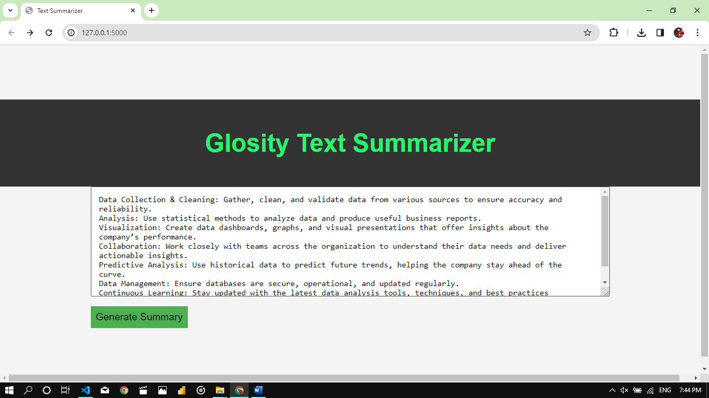

# Glosity_Internship_Task
## Text Summarizer
## Input screen for the text summarizer:

## Generated Summary:

## Required Libraries
- Flask
- NLTK
## How it works
The sentences in the text are first tokenized and their similarity is calculated using TextRank algorithm. Then the top sentences are extracted based on the summ_size varibale and the function returns the summary, original text, words in original text and words in summary. 
The file app.py has the flask app which has two routes the index or home page which directs the user to a page with a text box and a submit button, and the summarize page which has the information that the summarizer returns displayed.
